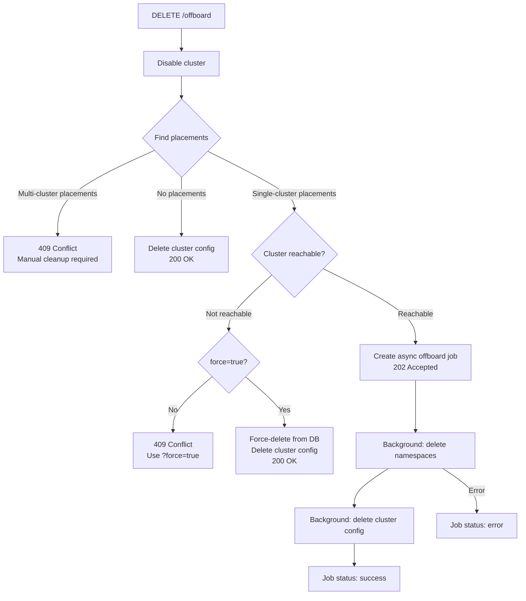

# OCP Shared Cluster Onboarding / Offboarding

## Overview

Two scripts automate the lifecycle of OCP shared clusters in the sandbox API fleet:

- **`onboard-ocp-shared-cluster.sh`** — Adds a cluster using the `PUT /api/v1/ocp-shared-cluster-configurations/{name}` (upsert) endpoint. Requires `oc` logged in to the target cluster.
- **`offboard-ocp-shared-cluster.sh`** — Removes a cluster using the `DELETE /api/v1/ocp-shared-cluster-configurations/{name}/offboard` endpoint. Only needs `curl` and `jq`.

## Prerequisites

### Onboarding
- **oc** (or kubectl) CLI, logged in as admin to the target cluster
- **curl** and **jq** installed
- A sandbox API admin login token
- Network access to the sandbox API

### Offboarding
- **curl** and **jq** installed
- A sandbox API admin login token
- Network access to the sandbox API

## Environment Variables

| Variable | Required | Description |
|----------|----------|-------------|
| `SANDBOX_API_ROUTE` | Yes | URL of the sandbox API (e.g. `https://sandbox-api.example.com`) |
| `SANDBOX_ADMIN_TOKEN` | Yes | Admin login token for the sandbox API |

### How to obtain the admin token

```bash
# For production:
export SANDBOX_API_ROUTE='https://sandbox-api.example.com'
export SANDBOX_ADMIN_TOKEN='<your-admin-login-token>'
```

## Onboarding a Cluster

### Basic Usage

Log in to the target cluster as admin, then:

```bash
oc login --server=https://api.my-cluster.example.com:6443 --token=<admin-token>

export SANDBOX_API_ROUTE='https://sandbox-api.example.com'
export SANDBOX_ADMIN_TOKEN='<admin-login-token>'

./tools/onboard-ocp-shared-cluster.sh
```

The script will:
1. Validate prerequisites (`oc`, `curl`, `jq`)
2. Extract cluster info from `oc` (API URL, ingress domain, name)
3. Create a `sandbox-api-manager` service account with cluster-admin on the target cluster
4. Generate a long-lived token (~10 years)
5. Call the sandbox API upsert endpoint to register the cluster
6. Validate the cluster health
7. Print cluster info and agnosticV variables

### Options

```bash
./tools/onboard-ocp-shared-cluster.sh [OPTIONS]

  --name <name>           Override auto-detected cluster name
  --purpose <purpose>     Set purpose annotation (default: dev)
  --annotations <json>    Additional annotations as JSON
  --config <file>         JSON config file (overrides defaults)
  --dry-run               Print payload without sending
  --force                 Bypass annotation validation (e.g. to set cloud=cnv)
  --skip-validation       Skip health check after onboarding
  --remove                Offboard the cluster (see below)
  -h, --help              Show help
```

### Custom Annotations

```bash
./tools/onboard-ocp-shared-cluster.sh \
  --purpose prod \
  --annotations '{"virt":"yes","keycloak":"yes","cloud":"cnv-shared"}'
```

### Annotation Validation

The `cloud` annotation is validated at two levels:

**1. OpenAPI schema** (enforced by the API middleware):

| Annotation | Allowed Values |
|------------|----------------|
| `cloud` | `cnv`, `cnv-shared`, `cnv-dedicated-shared`, `aws`, `aws-shared`, `aws-dedicated-shared`, `ibmcloud`, `ibmcloud-shared`, `ibmcloud-dedicated-shared` |
| `purpose` | `dev`, `prod`, `events` |

**2. Business rule** (enforced by the handler, bypassable with `--force`):

Bare provider values (`cnv`, `aws`, `ibmcloud`) are restricted to prevent accidental production pollution. Use the suffixed form instead:

```bash
# This works:
./tools/onboard-ocp-shared-cluster.sh --annotations '{"cloud":"cnv-shared"}'

# This requires --force:
./tools/onboard-ocp-shared-cluster.sh --force --annotations '{"cloud":"cnv"}'
```

The API also accepts `?force=true` as a query parameter on the PUT and POST endpoints.

### Using a Config File

For complex configurations (custom quotas, limit ranges, additional vars), use a JSON config file:

```bash
./tools/onboard-ocp-shared-cluster.sh --config my-cluster-config.json
```

The config file should contain any fields from the OcpSharedClusterConfiguration schema. The script will override `name`, `api_url`, `ingress_domain`, and `token` with auto-detected values.

## Building the JSON Input

The JSON payload matches the `OcpSharedClusterConfiguration` schema. Here's a complete example:

```json
{
    "name": "my-cluster",
    "api_url": "https://api.my-cluster.example.com:6443",
    "ingress_domain": "apps.my-cluster.example.com",
    "token": "<auto-generated-by-script>",
    "annotations": {
        "purpose": "dev",
        "name": "my-cluster",
        "virt": "yes",
        "cloud": "cnv-shared",
        "keycloak": "yes",
        "hcp": "no",
        "argocd": "yes"
    },
    "skip_quota": false,
    "usage_node_selector": "node-role.kubernetes.io/compute=",
    "max_memory_usage_percentage": 80,
    "max_cpu_usage_percentage": 100,
    "additional_vars": {
        "deployer": {
            "ai_storage_class": "ocs-storagecluster-ceph-rbd-virtualization",
            "openshift_cnv_ssh_address": "ssh.my-cluster.rhdp.net"
        }
    },
    "default_sandbox_quota": {
        "kind": "ResourceQuota",
        "apiVersion": "v1",
        "metadata": { "name": "sandbox-quota" },
        "spec": {
            "hard": {
                "pods": "30",
                "limits.cpu": "256",
                "limits.memory": "1280Gi",
                "requests.cpu": "256",
                "requests.memory": "1280Gi",
                "requests.storage": "1000Gi"
            }
        }
    },
    "limit_range": {
        "apiVersion": "v1",
        "kind": "LimitRange",
        "metadata": { "name": "sandbox-limit-range" },
        "spec": {
            "limits": [{
                "type": "Container",
                "default": { "cpu": "500m", "memory": "1Gi" },
                "defaultRequest": { "cpu": "250m", "memory": "512Mi" }
            }]
        }
    },
    "deployer_admin_sa_token_ttl": "3h",
    "deployer_admin_sa_token_refresh_interval": "1h",
    "deployer_admin_sa_token_target_var": "cluster_admin_deployer_sa_token"
}
```

### Minimal JSON (most fields have good defaults)

When using the script, you only need annotations. The script auto-detects `name`, `api_url`, `ingress_domain`, and creates the `token`:

```json
{
    "annotations": {
        "purpose": "dev",
        "virt": "yes",
        "cloud": "cnv-shared"
    }
}
```

Save this as `my-cluster.json` and run:
```bash
./tools/onboard-ocp-shared-cluster.sh --config my-cluster.json
```

### Default Values

If not specified, the following defaults are applied by the API:

| Field | Default |
|-------|---------|
| `valid` | `true` |
| `max_memory_usage_percentage` | `80` |
| `max_cpu_usage_percentage` | `100` |
| `usage_node_selector` | `node-role.kubernetes.io/worker=` |
| `skip_quota` | `true` |
| `quota_required` | `false` |
| `strict_default_sandbox_quota` | `false` |
| `default_sandbox_quota` | Standard quota (10 pods, 10 CPU, 20Gi memory, etc.) |
| `limit_range` | Container: 1 CPU / 2Gi default, 0.5 CPU / 1Gi request |

## Offboarding (Removing) a Cluster

There are two ways to offboard a cluster:

### Using the dedicated offboard script (recommended)

```bash
export SANDBOX_API_ROUTE='https://sandbox-api.example.com'
export SANDBOX_ADMIN_TOKEN='<admin-login-token>'

./tools/offboard-ocp-shared-cluster.sh --name my-cluster
```

The script handles all response types automatically: synchronous deletion, async polling with progress display, and formatted error/conflict reporting. It does not require `oc`.

### Using the onboard script with --remove

```bash
./tools/onboard-ocp-shared-cluster.sh --remove --name my-cluster
```

### Offboard script options

```bash
./tools/offboard-ocp-shared-cluster.sh [OPTIONS]

  --name <name>           Cluster name to offboard (required)
  --force                 Force offboard even if the cluster is unreachable
                          (deletes from DB without cleaning up namespaces)
  --poll-interval <secs>  Seconds between async polls (default: 5)
  --poll-timeout <secs>   Maximum wait for async offboard (default: 300)
  -h, --help              Show help
```

### How offboarding works



The offboard process:
1. **Disables** the cluster (prevents new scheduling)
2. **Rejects** with 409 if any placements span multiple clusters (manual cleanup needed)
3. If **no placements** exist, deletes cluster config synchronously (200)
4. If placements exist and cluster is **not reachable** without `?force=true`, returns 409
5. If placements exist and cluster is **not reachable** with `?force=true`, force-deletes everything from DB synchronously (200)
6. If placements exist and cluster **is reachable**, creates an **async offboard job** (202) for namespace cleanup
7. Poll `GET /api/v1/ocp-shared-cluster-configurations/{name}/offboard` for async job status

### Force Offboard

If the cluster is no longer reachable (decommissioned, network issues, etc.), use `--force`:

```bash
./tools/offboard-ocp-shared-cluster.sh --name my-cluster --force
```

This deletes all placement and resource records from the database without attempting to clean up namespaces on the actual cluster.

### Offboard Response

When there are no placements, the offboard returns 200 immediately:
```json
{
    "cluster_name": "my-cluster",
    "cluster_disabled": true,
    "placements_deleted": [],
    "placements_requiring_manual_cleanup": [],
    "cluster_deleted": true,
    "message": "Cluster offboarded successfully. No placements found. Cluster configuration removed."
}
```

When there are placements, the offboard returns 202 with a job to poll:
```json
{
    "request_id": "abc123",
    "status": "initializing",
    "message": "Offboard started for cluster my-cluster. 2 placement(s) to process."
}
```

The offboard script automatically polls `GET /api/v1/ocp-shared-cluster-configurations/my-cluster/offboard` until the job status is `success` or `error`, displaying progress along the way. The final report shows:

```
╔══════════════════════════════════════════════════════════════╗
║                     OFFBOARD REPORT                        ║
╚══════════════════════════════════════════════════════════════╝

  Cluster disabled: true
  Cluster deleted:  true

  Placements deleted (1):

    - placement 42  uuid=abc-123-...  status=deleted

  Cluster offboarded successfully. 1 placement(s) deleted. Cluster configuration removed.
```

If there are multi-cluster placements, the offboard returns 409 with details about which placements need manual cleanup. Delete those placements first, then re-run offboard.

## API Endpoints

### PUT /api/v1/ocp-shared-cluster-configurations/{name} (Upsert)

Creates the cluster if it doesn't exist (201), updates if it does (200). Uses the full `OcpSharedClusterConfiguration` schema.

### DELETE /api/v1/ocp-shared-cluster-configurations/{name}/offboard

Starts the offboarding workflow. Returns 200 with `OffboardReport` if no placements exist, or 202 with a job ID if placements need cleanup. Supports `?force=true` for unreachable clusters.

### GET /api/v1/ocp-shared-cluster-configurations/{name}/offboard

Returns the latest offboard job status for the given cluster. Poll until `status` is `success` or `error`.

## AgnosticV Configuration

After onboarding, use these variables in your agnosticV catalog item to target the cluster:

```yaml
# Target by name (exact match):
__meta__:
  sandboxes:
    - kind: OcpSandbox
      count: 1
      cloud_selector:
        name: my-cluster

# Target by purpose (any matching cluster):
__meta__:
  sandboxes:
    - kind: OcpSandbox
      count: 1
      cloud_selector:
        purpose: dev
```

## What the Script Creates on the Target Cluster

| Resource | Namespace | Name | Purpose |
|----------|-----------|------|---------|
| Namespace | - | `rhdp-serviceaccounts` | Hosts the service accounts |
| ServiceAccount | `rhdp-serviceaccounts` | `sandbox-api-manager` | API access for sandbox-api |
| ClusterRoleBinding | - | `sandbox-api-manager-cluster-admin` | Grants cluster-admin |
| Token | - | (bound to SA) | ~10 year token for API access |

The `deployer-admin` service account and its token are created automatically by the sandbox API's background rotation goroutine when `deployer_admin_sa_token_ttl` is configured.
